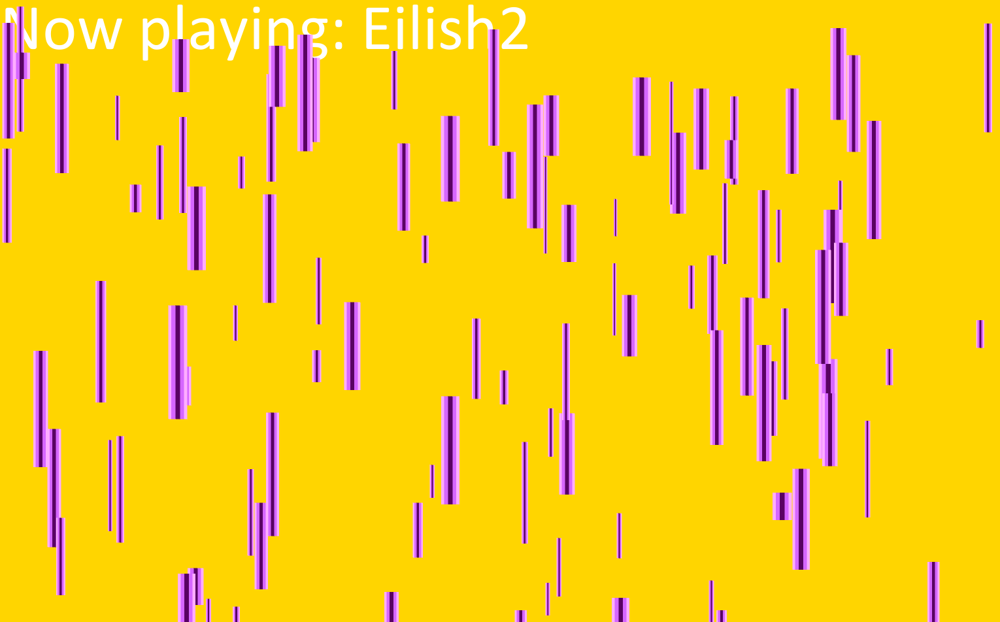

# Music Visualiser Project

| Student ID | Student Name |
|-----------|-----------|
| C22300773 | Aidan McPhee |
| C22386221 | Kimberly Libranza |
| C22408466 | Eilish Paseos |
| C22363431 | Jana Sy |

# Description of the assignment

 We made an audio visualiser to the song "Bling Blang Bang Born" by Creepy Nuts, using the various coding techniques we have learned in our Object Oriented Programming module for visualisations.

# Instructions

- Fork this repository and run the main.java file.
- To see the different viualisations of our group, use the *number keys: 1-8*
- To pause the song and visualisation use *spacebar*
- To fast forward or rewind the song use the arrow keys *left: rewind* and *right: fast forward*
- To concatonate an effect to a certain effect press the number keys you want to display
- You can unselect an effect by pressing the effect number key

# Visualisation Assets

| AssetS | Student | 
|-----------|-----------|
| SpinningSphere.java | C22300773 |
| Subtitle.java | C22300773 | 
| Partical.java | C22300773 | 
| SpinningSquares.java | C22363431 | 
| Terrain.java | C22363431 | 
| DiscoTiles.java | C22363431 | 
| DancingStickman.java | C22386221 | 
| MagicCircle.java | C22386221 | 
| SlidingText.java | C22386221 | 
| Rain.java | C22408466 |
| Star.java | C22408466 |

# How it works

 Each visualisation is within the creator's corresponding student number package. We created 8 different visualisations that you are able to cycle through using corresponding keys and concatonate together using the following code in the controller.java file.

``` java
public void controlVisual() {
        PGraphics g = song.getGraphics();
        String s = "Now playing: ";
        float smoothedAmplitude = song.getSmoothedAmplitude();
        if (playing.get("Kim")) {
            Kim.play(smoothedAmplitude);
            s = s.concat("Kim, ");
        }
        if (playing.get("Aidan1")) {
            Aidan.render(smoothedAmplitude);
            s = s.concat("Aidan1, ");
        }
        if (playing.get("Eilish")) {
            Eilish.Starfield(smoothedAmplitude);
            s = s.concat("Eilish, ");
        }
        if (playing.get("Jana")) {
            Jana.DiscTiles.drawTiles(smoothedAmplitude);
            s = s.concat("Jana");
        }
        if (playing.get("Eilish2")) {
            Eilish.Beams(smoothedAmplitude);
            s = s.concat("Eilish2");
        }
        if (playing.get("Jana2")) {
            Jana.SpSquares.drawSquares(smoothedAmplitude);
            s = s.concat("Jana2");
        }
        if (playing.get("Jana3")) {
            Jana.terrainGen.drawTerrain(smoothedAmplitude);
            s = s.concat("Jana3");
        }
        if (playing.get("Aidan2")) {
            Subtitle sub = song.sr.getCurrentSubtitle(song.getAudioPlayer().position() / 1000);
        
            if (sub != null) {
                String text = sub.getText();
                g.textAlign(Song.CENTER, Song.CENTER);
                g.textSize(64);
                g.text(text, g.width/2, g.height - 100);
            }
            s = s.concat("Aidan2");
        }
```

#Screenshots

###Key: 1


###Key: 2


###Key: 3


###Key: 4


###Key: 5


###Key: 6


###Key: 7


###Key: 8


# What I am most proud of in the assignment

## Aidan
I am most proud of the background work that i did on this assignment, being able to create a subtitles system, a controller for our visuals to be able to layer on top of eachother and the method of passing one singular PGraphics object between our classes to support this. I am also proud of my implementation of my sphere particle system using spherical coordinates.

## Eilish

I am most proud of how the group was able to create visualisations that work well together while also being able to stick to the theme of our song. I really liked how fun this project was as a whole and am glad that my visualisations turned out well.
## Jana

## Kim

